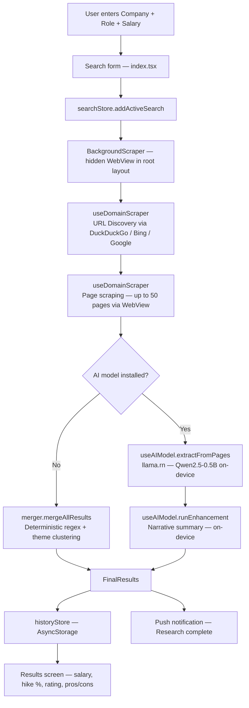

# HireScope — AI Job Research Assistant

**An on-device AI research tool that prepares you for your next salary negotiation.**


---

## What is this?

HireScope is a fully on-device Android app for Indian job seekers. Before your interview, enter the company, role, experience level, and your current salary — HireScope silently researches public web sources in the background and returns:

- **Salary range** for that role at that company in India
- **Expected hike %** over your current salary
- **Company rating** aggregated from review sites
- **Top pros and cons** of working there

Everything runs on your phone. No server. No login. No data leaves your device.

---

## ✨ Key Features

- 🧠 **AI-powered extraction** — optional on-device Qwen2.5 SLM extracts and summarizes scraped data
- 🔍 **Background research** — hidden WebView engine queries 13 search templates across DuckDuckGo, Bing, Google, Brave
- 💰 **Salary + hike calculation** — compares found salary ranges against your current pay
- ⭐ **Rating aggregation** — averages company ratings from Glassdoor, AmbitionBox, and other sources
- 📋 **Pros & Cons clustering** — semantic keyword clustering groups employee feedback into canonical themes
- 📱 **100% on-device** — AsyncStorage for history, no backend, no user accounts
- 🌗 **Light / Dark / System theme** — full three-way theme support from day one
- 🔔 **Background research notification** — notifies you when a long research job completes
- 📜 **Research history** — stores last 20 searches, re-viewable at any time

---

## 🧠 AI Capabilities

HireScope includes an optional on-device AI layer powered by **[llama.rn](https://github.com/mybigday/llama.rn)** (a React Native binding for llama.cpp):

- **Model:** Qwen2.5-0.5B-Instruct (Q4_K_M quantization, ~300 MB)
- **What it does:**
  1. **Extraction phase:** Sends raw scraped page text to the SLM in chunks — the model extracts structured data (salary figures, ratings, pros, cons) more accurately than regex alone.
  2. **Enhancement phase:** Generates a natural-language narrative summary from the aggregated structured data.
- **Fully on-device:** The model runs entirely on your phone — no API calls, no data uploads. Inference uses `llama.cpp` compiled for ARM via `llama.rn`.
- **Optional:** If the AI model is not downloaded, HireScope falls back to a deterministic Summary Engine (regex extraction + keyword clustering). The app is fully functional without it.

---

## 🛠 Tech Stack

| Layer | Technology |
|---|---|
| Framework | React Native + Expo SDK 54 |
| Routing | Expo Router (file-based) |
| Language | TypeScript |
| State management | Zustand (with AsyncStorage persistence) |
| On-device AI | llama.rn (llama.cpp for React Native) |
| AI Model | Qwen2.5-0.5B-Instruct (GGUF, q4_k_m) |
| Web scraping | React Native WebView (hidden, JS-injected) |
| Notifications | expo-notifications |
| Icons | @expo/vector-icons (Ionicons) |
| Build / CI | GitHub Actions → Expo prebuild → Gradle → Play Store |

---

## 🗺️ Architecture / Flow



---

## 📸 Screenshots

*(Available on the Play Store listing)*

---

## 🚀 Getting Started

### Prerequisites

- Node.js 20.x
- Java OpenJDK 17 (required for native Android builds only)
- Android device or emulator with Android Studio / ADB

### Run with Expo Go (UI development)

```bash
# Clone the repo
git clone <repo-url>
cd Hire_Scope

# Install dependencies
npm install

# Start the Metro bundler
npm run start
```

Scan the QR code with **Expo Go** on a physical Android device.

> **Note:** The on-device AI model (llama.rn) requires a custom native build and will not work under Expo Go. All other features work normally.

### Run as a native Android build (full features)

```bash
# Requires Android emulator or connected device
npm run android
```

This triggers `expo prebuild` and installs a native APK with full native plugin support including `llama.rn`.

---

## 📄 License

MIT — see [LICENSE](./LICENSE)

**Contact / support:** rutambhtrivedi@gmail.com  
**Play Store:** [com.rutambh.hirescope](https://play.google.com/store/apps/details?id=com.rutambh.hirescope)
